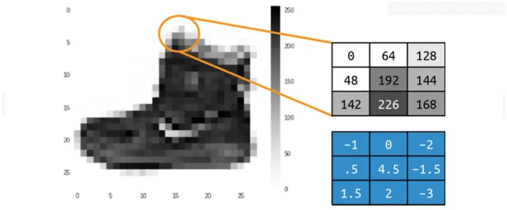
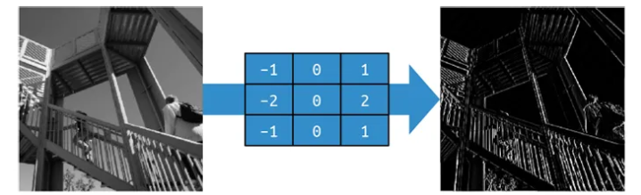
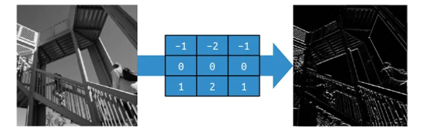
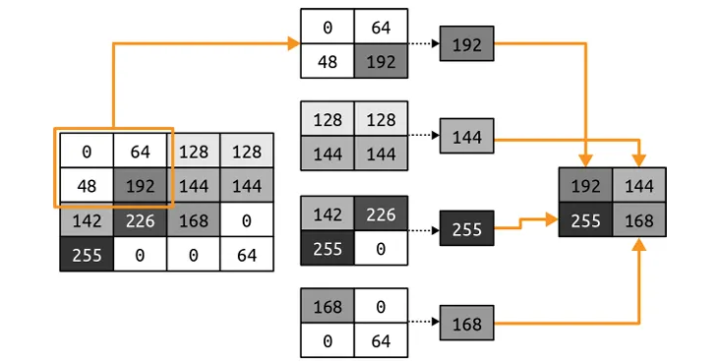
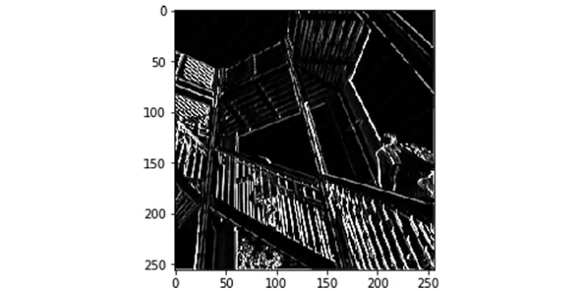

# **Horses and Humans Classifier**

This project will use Convolution Neural Network (CNN) to classify or determine determine what makes a horse a horse and a human a human

---
## **Convolution**

A convolution is simply a filter of weights that are used to multiply a pixel with its neighbors to get a new value for the pixel.

*Figure 1: Ankle boot with convolution.*

Look at the pixel in the middle of the selection, we can see that it has a value of **192** with a filter in the same **3 x 3 grid**, as shown below the original values $\rightarrow$ transform that pixel by calculating a new value by multiplying the current value of each pixel in the grid by the value in the same position in the filter grid, and summing up the total amount. This total will be the new value for the current pixel and repeat this for all pixels in the image.

So in this case, while the current value of the pixel in the center of the selection is 192, the new value after applying the filter will be:
$$new\_val = (-1 * 0) + (0 * 64) + (-2 * 129) + (0.5 * 48) + (4.5 * 192) +.... = 577$$

---
Consider the impact of applying a filter on a more complicated image: **the ascent image** (a 512 x 512 grayscale image)

Using a filter with **negative values on the left**, **positive values on the right**, and **zeros in the middle** will end up removing most of the information from the image except for vertical lines:

*Figure 2: Using a filter to get vertical lines*

Similarly, a small change to the filter can emphasize the horizontal lines:

*Figure 3: Using a filter to get horizontal lines*

$\Rightarrow$ These examples also show that the amount of information in the image is reduced, so we can learn a set of filters that reduce the image to features, and those features can be matched to labels as before.

---
## **Pooling**

Pooling is the process of eliminating pixels in your image while maintaining the semantics of the content within the image. It’s best explained visually.

A convolution combined with pooling, we can reduce the amount of information in the image while maintaining the features.

*Figure 4. Demonstrating **max pooling***

In this case, consider the box on the left to be the pixels in a monochrome image.

→ Then group them into 2x2 arrays so in this case, the 16 pixels are grouped into four 2x2 arrays. These are called ***pools***.

→ Then select the **max** value in each of the groups (pools), and reassemble those into a new image.

→ Thus, the pixe    ls on the left are reduced by 75% (from 16 to 4), with the max value from each pool making up the new image.

---
This ascent image with the vertical lines enhanced, after max pooling has been applied:

*Figure 5: Ascent after vertical filter and max pooling*