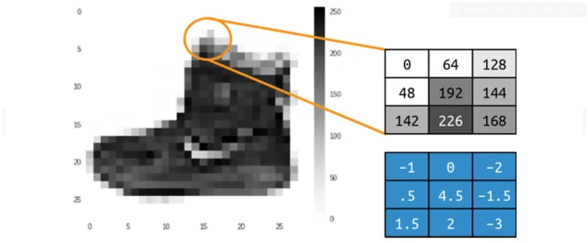

# **Horses and Humans Classifier**

This project will use Convolution Neural Network (CNN) to classify or determine determine what makes a horse a horse and a human a human

## **Convolution**

A convolution is simply a filter of weights that are used to multiply a pixel with its neighbors to get a new value for the pixel.

*Figure 1: Ankle boot with convolution.*